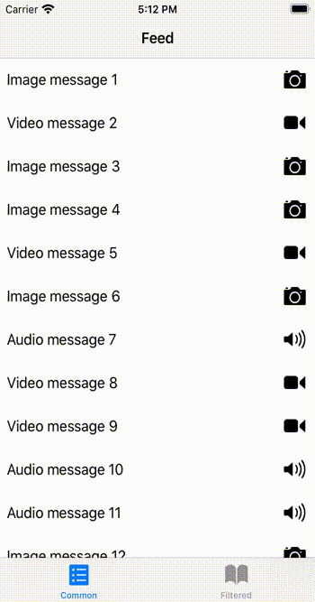

# Cursors

Any type of pagination using cursor pattern.

## Supported pagination types

- Cursor-based
- Page-based
- Offset-based

## Installation

### Requirements

- Any swift-supported platform
- Swift 5.0+ (Xcode 10.2+)

### Swift Package Manager

Cursors is available through Swift Package Manager. Add Cursors as a dependency to your Package.swift:

```swift
.package(url: "https://github.com/petropavel13/Cursors", from: "0.3.0")
```

## Basic types

There is only two basic cursor types each of which contains only one method.

### CursorType

Loads next page from data source and calls completion.

```swift
func loadNextPage(completion: @escaping ResultCompletion)
```

### BidirectionalCursorType

Loads previous page from data source and calls completion.

```swift
func loadPreviousPage(completion: @escaping ResultCompletion)
```

### CursorErrorType

Indicates whatever we reach the end of data source (i.e. data source exhausted).

```swift
var isExhausted: Bool { get }

static var exhaustedError: Self { get }
```

That's it. So simple.

## Traits

Each cursor can support some traits, available actions will depend on implemented traits. Everything is type safe, with compile-time checks.

### PositionableType

Move to arbitrary position in data source. Affects what next page will be loaded when you call `loadNextPage` or `loadPreviousPage`.

```swift
var movingForwardCurrentPosition: Position { get }

func seek(to position: Position)
```

### BidirectionalPositionableType

Inherit `PositionableType`, but take into account boundary positions when direction is important.

```swift
var movingBackwardCurrentPosition: Position { get }
```


### PageStrideableType

When `Position` type implements `PageIndexableType` position can be calculated relative to given page.

```swift
func position(after page: Position.Page) -> Position?
func position(before page: Position.Page) -> Position?
```

### ResettableType

Type with copy-like constructor, but it doesn't keep internal state. Suitable for Pull-to-refresh behaviour.

```swift
init(withInitialStateFrom other: Self)
```

### ClonableType

Type with copy constructor. Keeps internal state of original instance.

```swift
init(keepingStateOf other: Self)
```

## Implementations

### SimpleStubCursor

Two-dimension array wrapper.

```swift
let cursor = SimpleStubCursor(pages: [[1,2,3], [4,5]])
```

Implements: `CursorType`, `SkipableType`, `ResettableType`, `ClonableType`

### StubCursor

Unlike `SimpleStubCursor`, also implements `BidirectionalCursorType` and `SeekableType`. Contains more complex internal structure.

```swift
let cursor = StubCursor(pages: [[6,7,8], [9,0]])
let position = cursor.initialPosition // pageIndex: 0, elementIndex: 0
cursor.seek(to: position.offset(elements: 4)) // pageIndex: 1, elementIndex: 1
```

Implements: `CursorType`, `BidirectionalCursorType`, `SkipableType`, `SeekableType`, `ResettableType`, `ClonableType`

### CompactMapCursor

Applies [compactMap](https://developer.apple.com/documentation/swift/array/2957701-compactmap) operation to results of wrapped cursor.

```swift
let stubCursor = SimpleStubCursor(pages: [[1,2,3], [4,5]])
let cursor = CompactMapCursor(cursor: stubCursor) { String($0) }

// or just

let cursor = SimpleStubCursor(pages: [[1,2,3], [4,5]])
            .compactMap { String($0) }

// results will be            
// ["1","2","3"],["4","5"]
```

Implements: `CursorType`, `BidirectionalCursorType`, `SkipableType`, `SeekableType`, `ResettableType`, `ClonableType`

### FixedPageCursor

Wraps passed cursor and return fixed elements count on each `loadNextPage` call.

**Notice**: Behind the scenes, it calls `loadNextPage` of wrapped cursor required amount of times to achive this behaviour.

```swift
let stubCursor = SimpleStubCursor(pages: [[1,2,3], [4,5]])

let cursor = FixedPageCursor(cursor: stubCursor, pageSize: 2)

// or just

let cursor = SimpleStubCursor(pages: [[1,2,3], [4,5]])
            .paged(by: 2)

// results will be            
// [1,2],[3,4],[5]
```

Implements: `CursorType`, `ResettableType`

### AnyCursor

Type-erasure cursor for any `CursorType`.

```swift
let stubCursor = SimpleStubCursor(pages: [[1,2,3], [4,5]])

let cursor = AnyCursor(cursor: stubCursor)

// or just

let cursor = SimpleStubCursor(pages: [[1,2,3], [4,5]])
            .eraseToAnyCursor()

```

Implements: `CursorType`

### AnyBidirectionCursor

Type-erasure cursor for any `BidirectionalCursorType`.

```swift
let stubCursor = StubCursor(pages: [[1,2,3], [4,5]])

let cursor = AnyBidirectionalCursor(bidirectionalCursor: stubCursor)

// or just

let cursor = StubCursor(pages: [[1,2,3], [4,5]])
            .eraseToAnyCursor()

```

Implements: `CursorType`, `BidirectionalCursorType`

## Your Cursor

May look like:

```swift
import Cursors
import Combine

public final class MockFeedCursor: CursorType {
    public enum FeedError: CursorErrorType {
        case exhausted
        case decodingFailed

        public var isExhausted: Bool {
            return self == .exhausted
        }

        public static var exhaustedError: FeedError {
            return .exhausted
        }
    }

    public typealias Element = Content
    public typealias Failure = FeedError

    fileprivate var currentPage = 1

    private var cancellable: Cancellable?

    public init(currentPage: Int = 1) {
        self.currentPage = currentPage
    }

    public func loadNextPage(completion: @escaping ResultCompletion) {
        cancellable?.cancel()

        let url = URL(string: "https://ce159633-eed1-407d-805e-6490f369ef36.mock.pstmn.io/feed/?page=\(currentPage)")!

        var request = URLRequest(url: url)
        request.setValue("064911a53f8e47b0a5c8eff084143bfb", forHTTPHeaderField: "x-api-token")

         let session = URLSession.shared

        cancellable = session.dataTaskPublisher(for: request)
            .map { $0.data }
            .decode(type: PaginatedFeed.self, decoder: JSONDecoder())
            .sink(receiveCompletion: {
                if case .failure = $0 {
                    completion(.failure(.decodingFailed))
                }
            }, receiveValue: { [weak self] in
                self?.handle(result: $0,
                             pageIncrement: 1,
                             completion: completion)
            })
    }

    private func handle(result: PaginatedFeed, pageIncrement: Int, completion: ResultCompletion) {
        currentPage += pageIncrement
        let exhausted = currentPage >= result.totalPages

        completion(.success((result.feed, exhausted)))
    }
}

extension MockFeedCursor: ResettableType {
    convenience public init(withInitialStateFrom other: MockFeedCursor) {
        self.init()
    }
}

extension MockFeedCursor: ClonableType {
    public convenience init(keepingStateOf other: MockFeedCursor) {
        self.init(currentPage: other.currentPage)
    }
}
```

## Example

CursorsExample project contains simple example of pagination.




## Will be implemented later

- [ ] FixedPageCursor traits: `BidirectionalCursorType`, `SkipableType`, `SeekableType`, `ClonableType`
- [ ] ThreadSafeCursor
